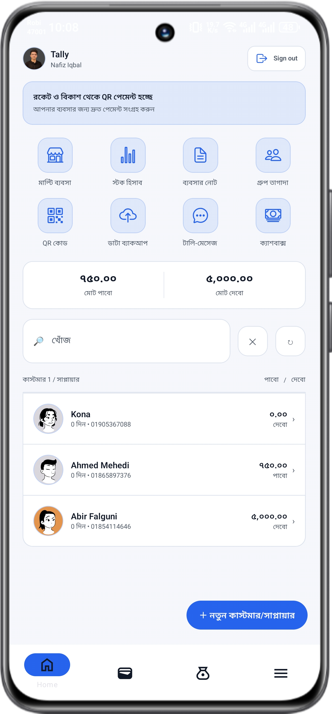
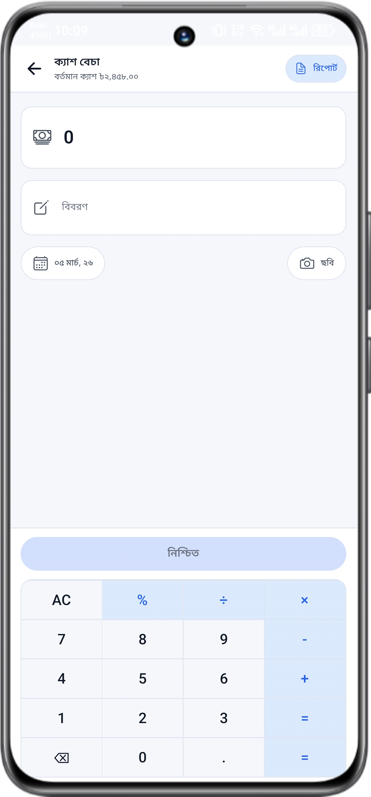
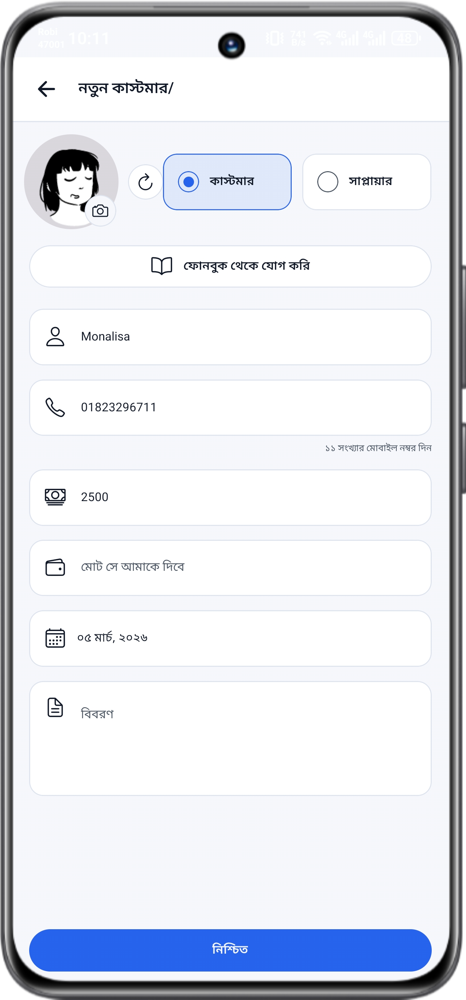
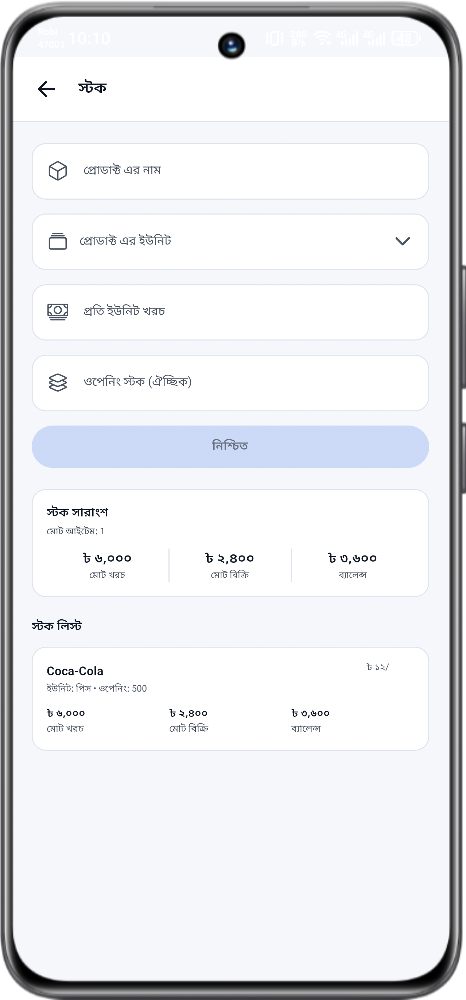
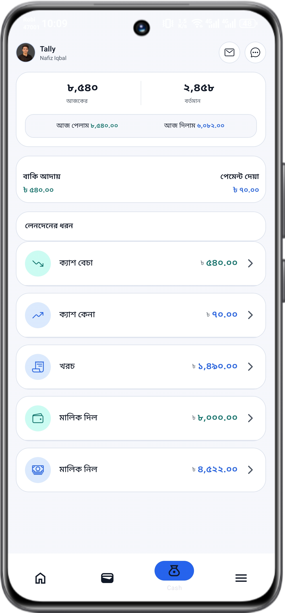

# TallyKhata Clone App (Expo + React Native + Supabase + Clerk)

[](https://expo.dev/)
[](https://reactnative.dev/)
[](https://www.typescriptlang.org/)
[](https://supabase.com/)
[](https://clerk.com/)

TallyKhata Clone is a mobile bookkeeping and small-business ledger app built with Expo and React Native. It is designed for daily business accounting workflows such as cashbook entries, stock tracking, customer/supplier due management, and social sign-in based access.

This project is inspired by the original TallyKhata app on Google Play:
`https://play.google.com/store/apps/details?id=com.progoti.tallykhata&pcampaignid=web_share`

## Features

- Mobile-first bookkeeping app with Bengali-first UI patterns
- Social authentication via Clerk SSO (Google, Apple, Facebook)
- Cashbook workflow with categorized entries:
  - `cash_sale`, `cash_buy`, `expense`, `owner_gave`, `owner_took`
- Built-in numeric keypad experience for quick amount entry and expression evaluation
- Daily and current cash overview (via Supabase RPC)
- Customer/Supplier management:
  - Create and edit party profiles
  - Phone normalization for Bangladeshi numbers
  - Receivable and payable tracking
  - Date and note support
  - Avatar support (gallery + generated fallback)
  - Phonebook import (Expo Contacts)
- Stock management:
  - Add and edit stock items
  - Unit selection and cost-per-unit input
  - Opening stock and stock summary cards
- Image attachment support for cashbook entries and profile avatars
- Tab-based navigation (Home, Wallet, Cashbook, Menu)
- Supabase-backed persistence with SQL setup scripts included in `sql/`

## App Logo

<p align="center">
   
</p>

## Screenshots

<p align="center">
   
   
   
</p>
<p align="center">
   
   
   
</p>

## Tech Stack

- Expo SDK 55
- React Native 0.83
- TypeScript
- Expo Router (file-based routing)
- NativeWind + Tailwind CSS
- Clerk Expo (authentication)
- Supabase (database + data APIs)
- Expo SQLite, Expo Contacts, Expo Image Picker

## Project Structure

```text
src/
   app/
      (auth)/
      (tabs)/
      cashbook-form.tsx
      customer_supplier.tsx
      stock.tsx
      hooks/
   lib/
      supabase.ts
sql/
   businesses_setup.sql
   cashbook_setup.sql
   customer_supplier_setup.sql
   stocks_setup.sql
assets/
   images/
   screenshots/
```

## Getting Started

### 1. Prerequisites

- Node.js 18+
- npm
- Expo CLI (optional, via `npx expo`)
- A Clerk project
- A Supabase project

### 2. Install Dependencies

```bash
npm install
```

### 3. Configure Environment Variables

Create a `.env` file in the project root:

```bash
EXPO_PUBLIC_CLERK_PUBLISHABLE_KEY=your_clerk_publishable_key
EXPO_PUBLIC_SUPABASE_URL=your_supabase_project_url
EXPO_PUBLIC_SUPABASE_ANON_KEY=your_supabase_anon_key
```

### 4. Prepare Database (Supabase)

Run the SQL files in this order inside the Supabase SQL Editor:

1. `sql/businesses_setup.sql`
2. `sql/cashbook_setup.sql`
3. `sql/customer_supplier_setup.sql`
4. `sql/stocks_setup.sql`

### 5. Start the App

```bash
npm run start
```

Use one of:

- `npm run android`
- `npm run ios`
- `npm run web`

## Available Scripts

- `npm run start` - start Expo dev server
- `npm run android` - launch Android target
- `npm run ios` - launch iOS target
- `npm run web` - run web target
- `npm run lint` - run lint checks

## SEO Keywords

If you publish this repository, these terms help discoverability for developers and recruiters:

- tallykhata clone
- react native bookkeeping app
- expo accounting app
- small business ledger app
- cashbook app with supabase
- bangla business accounting app

## Current Status

Active development. Core modules are working: auth, cashbook, stock, and customer/supplier workflows.

## Important Disclaimer

This is an independent educational/portfolio project inspired by TallyKhata.

- Not affiliated with or endorsed by Progoti Systems Ltd.
- "TallyKhata" and associated branding belong to their respective owners.

## Contributing

Contributions are welcome.

1. Fork the repository
2. Create a feature branch
3. Commit your changes
4. Open a pull request

## License

No license file has been added yet.
If you plan to open-source this project, add a license (for example MIT) in a `LICENSE` file.
